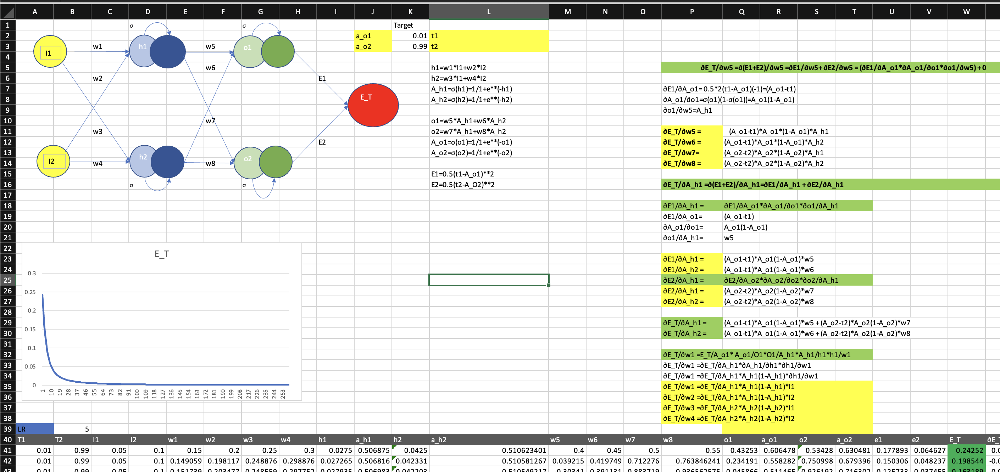

# EVA8 - Session3

Part 1

Q 1. Rewrite the whole excel sheet showing backpropagation. Explain each major step.

* [EXCEL SHEET HERE](https://github.com/visionenthusiast/EVA8/blob/main/S3/Part1/BackPropagation.xlsx)

Q 1.a Use exactly the same values for all variables as used in the class

Q 1.d Major Steps

* Initialise weights  w1 = 0.15, w2 = 0.2, w3 = 0.25, w4 = 0.3, w5 = 0.4, w6 = 0.45, w7 = 0.5, w8 = 0.55
* Sigmoid Activation function used for normalising values between 0 and 1
* Forward propagation - Given the weights and inputs this function calculates the predicted output of the netowrk
* Error Calculation - Calculate Squared Error between predicted output and target values

* Gradient functions for each weights of the netowrk - This determines the direction and size of step we could take in the direction of minima. Two gradient functions are defined one for each layer. gradient_layer1 function updates the weights that connect the input layer to the hidden layer. gradient_layer2 function updates the weights that connect the hidden layer to output layer.

* Updation of weights - Each weight is updated by taking only a fraction of step size. The fraction here is defined using learning rate. Higher the learning rate greater the step we take. As a common practice learning rates are in the range between 0 to 1.
* Everything is run for mutiple epochs to achieve the desired result.

Part 2, Solution
[Notebook](https://github.com/visionenthusiast/EVA8/tree/main/S3/Part2)

The Metrics of MOdel Traning